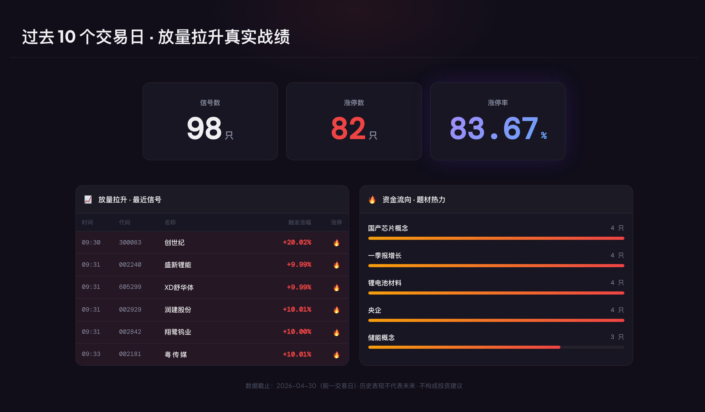

# MBY 股票开盘观察 Agent

> Repo: `mby-stock-trading-agent`  
> 一个不开放源码的 A 股盘中信号观察项目：9:25 竞价异动，9:30-9:40 自动筛选开盘强势信号。

A 股 5000+ 只股票，开盘前 15 分钟决定了一天的大部分交易节奏。

**9:25，看竞价异动。**  
**9:30-9:40，用 AI + 量化规则自动扫完全市场。**

MBY 股票开盘观察 Agent 不是荐股工具，也不替你做买卖决策。它更像一个盘中雷达：帮你更早看到竞价异动、放量拉升、题材共振和强势信号。



> 示例数据为历史信号整理，仅用于展示复盘框架，不构成投资建议。

## 这个项目是什么？

这是 MBY 股票开盘观察 Agent 的公开介绍仓库。

它不包含产品源码，不包含接口、不包含数据库、不包含核心算法。

它只展示：

- 产品解决什么问题
- 适合什么样的股票交易者
- 9:25 竞价异动怎么看
- 9:30-9:40 自动选票的观察框架
- 盘中信号如何理解
- 放量拉升、题材共振、信号持续性如何复盘
- 金融内容合规边界

## 核心能力

### 1. 9:25 竞价异动

开盘前先看哪些股票在集合竞价阶段已经出现异常强度。

这一步解决的是：

> 今天哪些票开盘前已经不一样？

### 2. 9:30-9:40 自动选票

开盘前 10 分钟自动扫描全市场，筛出放量拉升、题材共振和强势信号。

这一步解决的是：

> 开盘后真正动起来的是谁？

### 3. 盘中强势信号监控

持续观察信号是否扩散、持续、回落，是否形成题材共振。

这一步解决的是：

> 哪些方向正在成为市场主线？

### 4. 盘后复盘

把信号后的表现、题材延续、强弱变化沉淀成复盘素材。

这一步解决的是：

> 今天哪些信号有效？哪些只是盘中脉冲？

## 谁适合用？

### 第一类：懂市场情绪的人

如果你能判断当前市场处在冰点、分歧、修复还是高潮，MBY 会更有用。

工具负责把盘中强势信号先筛出来，你负责判断这些信号是不是出现在合适的情绪节点。

### 第二类：有基本面和题材理解的人

如果你本来就懂方向、懂逻辑、懂产业链，MBY 更像一个盘中雷达。

它每天帮你从全市场里筛出最强势的一批票，你再结合自己的判断，挑出真正符合逻辑的方向。

## 它不做什么？

- 不做基本面分析
- 不判断个股能走多远
- 不提供买卖点
- 不承诺收益
- 不替你做交易决策

## 正确打开方式

MBY 负责回答：

> 当下市场里，谁正在变强？

你负责回答：

> 这个方向值不值得继续跟踪？

工具负责筛选，判断仍然属于你。

## 仓库目录

```text
docs/          产品介绍、盘中信号框架、合规说明
examples/      示例截图
keyword-bank/  股票信号关键词
assets/        Logo 与品牌素材
```

## 产品链接

官网：<https://miaobanya.com/>

## 体验入口

如果你想看真实的盘中监控和每日信号复盘，可以先打开官网：<https://miaobanya.com/>

也可以关注公众号：**喵板鸭**。

关注后回复：**喵板鸭**，获取试用入口和邀请码。

## 免责声明

本仓库不提供任何投资建议，不推荐具体股票，不承诺收益，不构成买卖依据。

所有内容仅用于 AI 工具、股票盘中信号观察和历史数据复盘方法研究。
