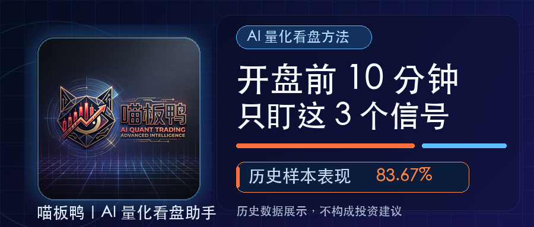
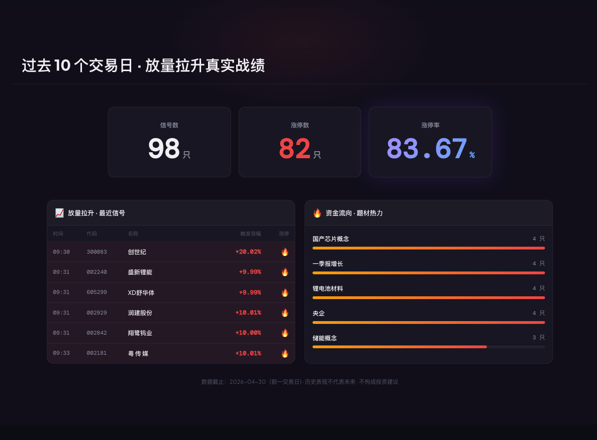
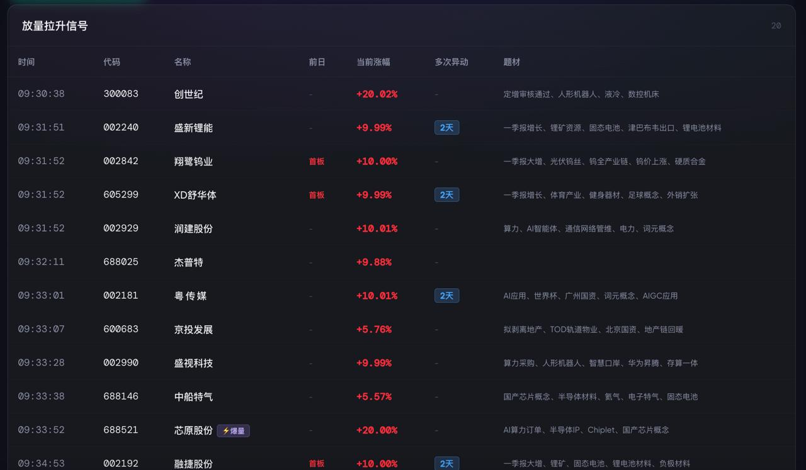
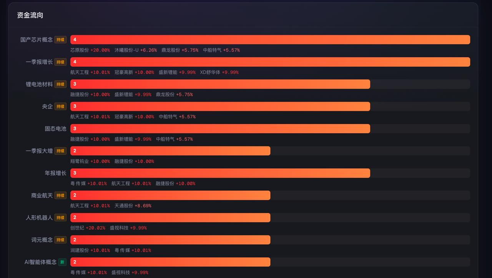
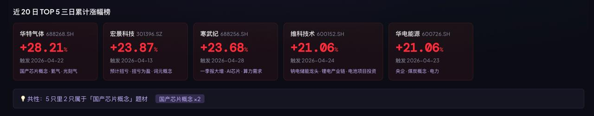

  

<h1 align="center">MBY Stock Trading Agent</h1>

  <strong>一个能在盘中发现机会，在盘后持续进化的 AI 交易助手</strong> 
  让新手看懂市场，让老手节省时间。每天开盘 5 分钟，看懂 A 股今天发生了什么。

  <a href="https://miaobanya.com/">产品官网</a> ·
  <a href="docs/00-who-should-use-miaobanya.md">适合谁用</a> ·
  <a href="docs/01-925-auction-watch.md">9:25 竞价</a> ·
  <a href="docs/02-930-940-opening-selection.md">9:30–9:40 开盘</a> ·
  <a href="docs/08-risk-disclaimer.md">风险声明</a>

  
  
  
  

---

## 这个项目解决什么问题？

A 股 5000 多只股票，每天 **9:25 竞价、9:30 开盘、9:30–9:40 第一波资金攻击**，信息密度极高。

真正难的不是“看行情”，而是快速判断：

- 今天谁先动？
- 哪个方向在聚集？
- 哪些信号值得继续观察？
- 哪些只是噪音，应该过滤掉？

喵板鸭把这些盘面变化整理成一套可复盘的观察流程：

- **9:25 竞价异动**：看开盘前谁已经先动；
- **9:30–9:40 开盘强势信号**：看资金第一波攻击方向；
- **盘中监控**：持续观察放量拉升、弱转强、题材扩散和主线变化；
- **盘后复盘**：回看信号是否有效，让观察框架持续进化。

---

## 核心看点

<table>
  <tr>
    <td width="25%"><strong>9:25</strong> 竞价异动</td>
    <td width="25%"><strong>9:30–9:40</strong> 开盘强势</td>
    <td width="25%"><strong>盘中</strong> 放量 / 题材 / 主线</td>
    <td width="25%"><strong>盘后</strong> 样本复盘</td>
  </tr>
  <tr>
    <td>高开强度、竞价成交、昨日强势股承接。</td>
    <td>第一波资金攻击、快速上攻、题材集中。</td>
    <td>放量拉升、弱转强、资金流向、情绪变化。</td>
    <td>信号延续性、冲高回落、主线形成与失效。</td>
  </tr>
</table>

---

## 产品截图

### 过去 10 个交易日 · 放量拉升真实战绩

这张图展示的是官网当前的近 10 个交易日放量拉升样本统计。重点不是承诺收益，而是展示喵板鸭如何把盘中异动、资金流向和题材热力整理成可复盘的观察材料。

> 数据工具，不荐股，不构成投资建议。历史表现不代表未来。

<strong>更多盘中观察样例</strong>

### 放量拉升信号大表格

### 资金流向完整横条图

### 近 20 日 TOP5 三日累计涨幅榜

---

## 谁最适合用？

更适合这两类人：

1. **懂情绪周期的人**  
   能理解冰点、分歧、修复、高潮、退潮，不把信号当成买卖指令。

2. **有方向判断能力的人**  
   对产业逻辑、题材持续性、公司质地有基本判断，想用工具节省盘中筛选时间。

不适合这类人：

- 想要别人直接告诉你买哪只；
- 想找自动交易机器人；
- 想靠单个指标做决策；
- 不愿意复盘，只想看结果。

---

## 文档索引

- [谁最适合使用喵板鸭？](docs/00-who-should-use-miaobanya.md)
- [9:25 竞价异动怎么看？](docs/01-925-auction-watch.md)
- [9:30–9:40 开盘强势信号怎么筛？](docs/02-930-940-opening-selection.md)
- [放量拉升怎么理解？](docs/03-volume-surge.md)
- [弱转强怎么看？](docs/04-weak-to-strong.md)
- [主线板块与题材集中](docs/05-mainline-sector.md)
- [市场情绪周期](docs/06-market-emotion.md)
- [每日复盘框架](docs/07-daily-review-framework.md)
- [风险声明](docs/08-risk-disclaimer.md)
- [近 10 个交易日样本观察](cases/2026-05-01-10day-sample.md)

---

## 关注公众号

如果你对 A 股盘中监控、开盘异动、题材主线和 AI 投资工具感兴趣，欢迎扫码关注公众号 **AI财有术**。

后续会围绕「AI + 投资研究」持续分享：

- 开盘 9:25 竞价异动观察；
- 9:30–9:40 强势信号复盘；
- 盘中放量拉升与题材热力样例；
- AI 辅助看盘、复盘和研究的方法；
- 适合 AI 投资者的工具、数据和实战框架。

我们也会建立一个专门面向 **AI 投资者** 的交流群，讨论如何用 AI 提升研究效率、看盘效率和复盘质量。

如果你是基本面研究高手，熟悉行业逻辑、公司研究、财报分析或产业趋势，也欢迎一起共建，让喵板鸭不只看到盘中异动，也能更好理解异动背后的基本面逻辑。

扫码关注公众号，回复 `体验`，一起把 A 股观察做得更系统。

   
  <strong>公众号：AI财有术</strong>

